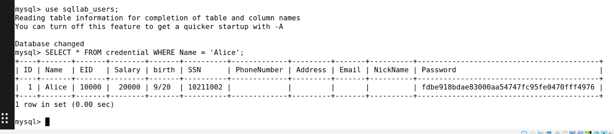
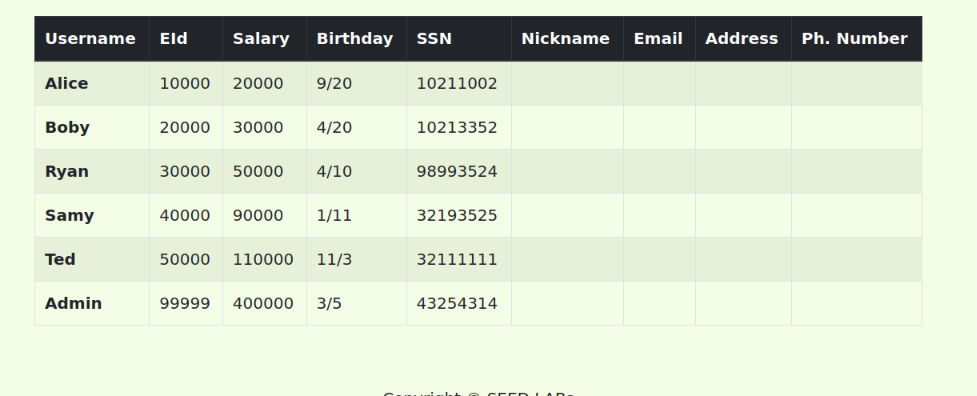
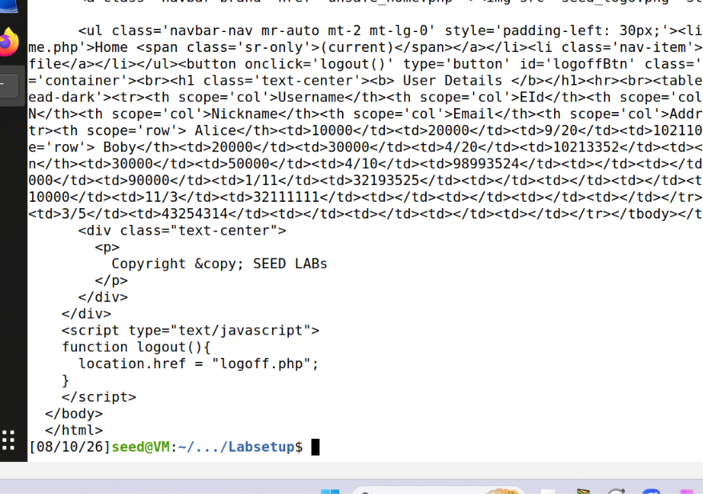

# SQL Injection Attack Lab - Setup & Task 1 Guide
# دليل إعداد وحل التاسك الأول لمختبر حقن قواعد البيانات

## Overview / الفكرة العامة

### English
This lab focuses on **SQL Injection (SQLi)**, a code injection technique that exploits vulnerabilities in the interface between web applications and backend database servers. When user inputs are not properly checked or sanitized, attackers can manipulate SQL queries to view, modify, or delete unauthorized data. The goal of this lab is to understand how these vulnerabilities occur, how to exploit them, and how to defend against them using techniques like prepared statements.

### العربية
يركز هذا اللاب على ثغرات **حقن قواعد البيانات (SQL Injection)**، وهي تقنية استغلال تحدث عندما لا يتم التحقق من مدخلات المستخدمين بشكل صحيح قبل إرسالها إلى قاعدة البيانات. يتيح ذلك للمهاجم التلاعب بالاستعلامات لرؤية أو تعديل أو حذف بيانات غير مأذون بها. الهدف من هذا اللاب هو فهم كيفية حدوث هذه الثغرات، وطريقة استغلالها، وكيفية الحماية منها باستخدام الاستعلامات المحضرة (Prepared Statements).

---

## Lab Environment & First Steps / بيئة العمل والخطوات الأولى

### English
1. **Navigate to the Lab Directory:** Unzip the lab files and open the terminal inside the `Labsetup` folder.
2. **Start the Containers:** Use Docker Compose to build and start the web application and MySQL database containers in the background. `dcup`
3. **Configure Hostname Mapping:** Map the web server IP (`10.9.0.5`) to the domain `www.seed-server.com` in your `/etc/hosts` file.
:
### العربية
1. **الانتقال إلى مجلد اللاب:** فك ضغط ملفات اللاب وفتح التيرمنال داخل مجلد `.
2. **تشغيل الحاويات:** استخدام Docker Compose لبدء تشغيل حاويات تطبيق الويب وقاعدة البيانات في الخلفية.
3. **ربط اسم النطاق:** ربط عنوان الـ IP الخاص بخادم الويب (`10.9.0.5`) بالرابط `www.seed-server.com` داخل ملف `/etc/hosts` في جهازك.

## الخطوات القادمة بالترتيب:
1.تشغيل الحاويات (Containers):
بما أنكِ داخل مجلد Labsetup الآن، قومي بتشغيل حاويات الـ Docker عبر استخدام أمر التشغيل (أو اختصاره):
`dcup`
2-تعديل ملف الـ hosts (ربط الـ IP بالرابط):
افتحي نافذة تيرمنال جديدة أو استخدمي محرر النصوص لتعديل ملف الـ /etc/hosts بصلاحيات الـ root لإضافة رابط موقع اللاب:
`sudo nano /etc/hosts`

وأضيفي هذا السطر في نهاية الملف وحفظيه:
`10.9.0.5    www.seed-server.com`
```bash
# ==========================================
# الخطوة 3: الدخول إلى حاوية قاعدة البيانات (MySQL)
# Step 3: Access the MySQL database container
# ==========================================

# استخدام أمر الـ dockps لمعرفة الـ ID أو الدخول مباشرة للـ MySQL باستخدام بيانات الـ root
# (Username: root, Password: dees)
mysql -u root -pdees

# ==========================================
# الخطوة 4: حل Task 1 (استعراض قاعدة البيانات وجدول الموظفة Alice)
# Step 4: Task 1 Operations (Exploring database and querying Alice's profile)
# ==========================================

# داخل شل الـ MySQL، قم بتنفيذ الأوامر التالية بالترتيب:

# 1. اختيار قاعدة البيانات الخاصة باللاب
# use sqllab_users;

# 2. عرض الجداول الموجودة للتأكد من وجود جدول credential
# show tables;

# 3. طباعة جميع معلومات الملف الشخصي للموظفة Alice (حل التاسك المطلوب)
# SELECT * FROM credential WHERE Name = 'Alice';
```

## 3. معرفة أرقام الحاويات العاملة (List Active Containers)
استخدمي الأمر التالي لعرض الحاويات النشطة ومعرفة الـ ID الخاص بحاوية الـ MySQL `dockps` 
* (سيظهر لكِ الـ ID الخاص بحاوية الـ mysql والذي يبدأ عادةً بأحرف مثل 2d64...)
## 4. الدخول إلى شل حاوية الـ MySQL (Access MySQL Container Shell)
بما أن أمر الـ mysql غير مثبت على الجهاز الأساسي، يجب الدخول إلى داخل شل حاوية الـ MySQL مباشرة باستخدام أول أحرف من الـ ID الخاص بها:    `docksh 2d64`
## 5. الاتصال بقاعدة البيانات (Connect to MySQL Monitor)  
`mysql -u root -pdees`
## 6. تنفيذ استعلام Task 1 واستخراج بيانات Alice (Execute Task 1 Query)
بعد ظهور علامة التفاعل (mysql>)، قومي باختيار قاعدة البيانات الخاصة باللاب ثم تنفيذ الاستعلام المطلوب لإحضار معلومات الموظفة أليس:
`use sqllab_users;
SELECT * FROM credential WHERE Name = 'Alice';`



 ## SQL Injection Lab - Task 2.1: Web Login Attack

This guide explains how to bypass the login authentication using SQL Injection.

## 1. Objective (الهدف)
To log into the web application as the 'admin' user without knowing the password, by injecting malicious SQL code into the username field.

## 2. Steps (الخطوات)

1.  **Start the Web Container (تشغيل حاوية الويب):**
    Ensure your web container is running. If not, go to the `Labsetup` directory and run:
    ```bash
    cd Desktop/Labsetup
    dcup
    ```
* بتكوني عامليتهم قبل من التاسك الاول
2.  **Access the Login Page (الدخول لصفحة تسجيل الدخول):**
    Open your web browser inside the VM and go to:
    `http://www.seed-server.com`

3.  **Execute the Attack (تنفيذ الهجوم):**
    *   In the **Username** field, enter the following payload:
        `admin' -- `
        *(Note: The space after the two dashes is very important.)*
    *   Leave the **Password** field empty.
    *   Click **Login**.

## 3. How it Works (شرح الثغرة - لماذا نجحت؟)
The application constructs an SQL query in the background like this:
`SELECT ... FROM credential WHERE name = 'INPUT_USERNAME' AND Password = 'HASHED_PASSWORD';`

### The Injection `admin' -- ` breakdown:
*   **`'` (Single Quote):** This closes the 'name' string field in the SQL query prematurely.
*   **`-- ` (Double Dash + Space):** This is the SQL **comment** symbol. It tells the database to ignore everything that comes after it in the query.

**Resulting Query:**
The database executes: `SELECT ... FROM credential WHERE name = 'admin'` and **ignores** the password check entirely. This tricks the system into granting you access as the administrator.
 


 ## SQL Injection Lab - Task 2.2: Web Login Attack

This guide explains how to perform the SQL Injection attack using the command line instead of the web browser.

## 1. Objective (الهدف)
To perform the same SQL Injection attack as in Task 2.1, but using command-line tools like `curl` to send HTTP requests directly to the server.

## 2. Important Notes & Troubleshooting (ملاحظات هامة)

*   **Where to execute:** Do **not** execute the `curl` command inside the MySQL container (the one showing `mysql>`). You must run it from the main terminal of your virtual machine (e.g., inside the `Labsetup` directory).
*   **Why:** The `curl` command sends HTTP requests to the web application. The MySQL container is only for database management, while the web requests must be handled by the web container or the host environment.
*   **Encoding:** Since we are using special characters (`'`, space) in a URL, we must encode them:
    *   `'` becomes `%27`
    *   Space becomes `%20`

## 3. Steps (الخطوات)

1.  **Open the Terminal:** Ensure you are in your working directory (e.g., `~/Labsetup`).
2.  **Execute the Attack:** Run the following command:
    ```bash
    curl 'www.seed-server.com/unsafe_home.php?username=admin%27%20--%20&Password='
    ```
3.  **Result:** The terminal will display the raw HTML of the page. You will see employee data (like 'Alice', 'Boby', 'Admin') within the HTML tags, confirming the attack was successful.



